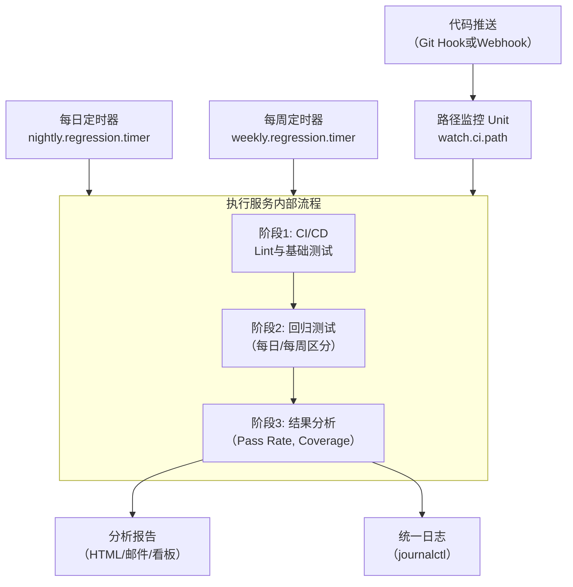

# my dotfiles

## ci/cd

```mermaid
flowchart TD
    A[代码推送<br>（Git Hook或Webhook）] --> B[路径监控 Unit<br>watch.ci.path]
    C[每日定时器<br>nightly.regression.timer] --> D[执行服务 Unit<br>run.verification.service]
    E[每周定时器<br>weekly.regression.timer] --> D
    
    B --> D
    
    subgraph D [执行服务内部流程]
        D1[阶段1: CI/CD<br>Lint与基础测试] --> D2[阶段2: 回归测试<br>（每日/每周区分）]
        D2 --> D3[阶段3: 结果分析<br>（Pass Rate, Coverage）]
    end
    
    D3 --> F[分析报告<br>（HTML/邮件/看板）]
    D3 --> G[统一日志<br>（journalctl）]
```
